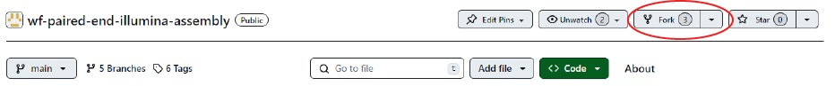

# How to add a module to the [wf-paired-end-illumina-workflow](https://github.com/bacterial-genomics/wf-paired-end-illumina-assembly)

## Contributing to the workflow

If you'd like to write some code for wf-paired-end-illumina-assembly, the standard workflow is as follows:

1. Check that there isn't already an issue about your idea in the [bacterial-genomics/wf-paired-end-illumina-assembly issues](https://github.com/bacterial-genomics/wf-paired-end-illumina-assembly/issues) to avoid duplicating work. If there isn't one already, please create one so that others know you're working on this
2. [Fork](https://help.github.com/en/github/getting-started-with-github/fork-a-repo) the [bacterial-genomics/wf-paired-end-illumina-assembly repository](https://github.com/bacterial-genomics/wf-paired-end-illumina-assembly) to your GitHub account
3. Make the necessary changes / additions within your forked repository following [Pipeline conventions](#pipeline-contribution-conventions)
4. Use `nf-core schema build` and add any new parameters to the pipeline JSON schema (requires [nf-core tools](https://github.com/nf-core/tools) >= 1.10).
5. Submit a Pull Request against the `dev` branch and wait for the code to be reviewed and merged

If you're not used to this workflow with git, you can start with some [docs from GitHub](https://help.github.com/en/github/collaborating-with-issues-and-pull-requests) or even their [excellent `git` resources](https://try.github.io/).

## Fork the GitHub [wf-paired-end-illumina-workflow](https://github.com/bacterial-genomics/wf-paired-end-illumina-assembly) repository

The first step is to fork the  [wf-paired-end-illumina-workflow](https://github.com/bacterial-genomics/wf-paired-end-illumina-assembly) repository:

1. On the [GitHub repository](https://github.com/bacterial-genomics/wf-paired-end-illumina-assembly) in the top right corner, click **Fork**.

2. Under "Owner", select the dropdown menu and click and owner for the forked repository.
3. By default, forks are named the same as their upstream repositories. Optionally, to further distinguish your fork, in the "Repository name" field, type a name.
4. Unselect "Copy the `main` branch only. The new module should be added to the `dev` branch of the workflow.
5. Click **Create fork**. 
6. Then clone your forked repository:
    `git clone git@github.com:YOURUSERNAME/wf-paired-end-illumina-assembly.git`
7. Then create a new branch on your forked repository:
    `git checkout -b NEWBRANCHNAME`

Please create a new branch with the appropriate branch name for the module you are trying to add.  This will make things easier when reviewing and ultimiately merging the branches on the repository.

